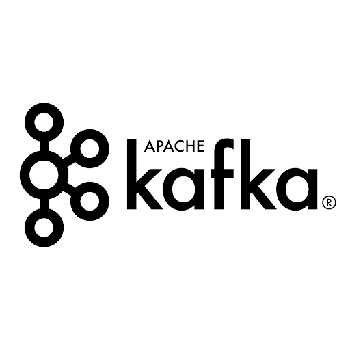
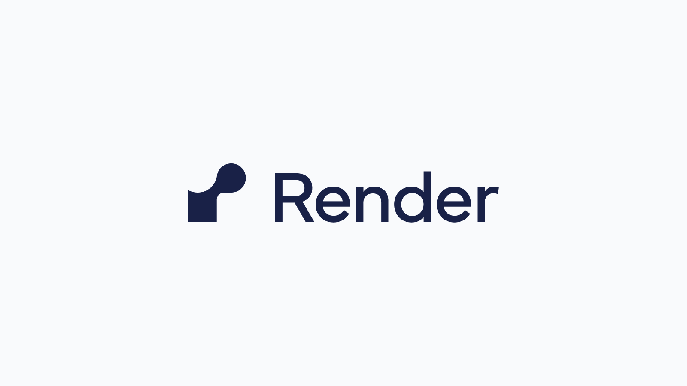

# ⚡ 4 in a Row - Real-time Multiplayer Game 🎯

<div align="center">
  
  
  
  
  
</div>

A professional Connect Four game with real-time multiplayer, competitive AI bot, and analytics system built with **Go backend** and React frontend.

## 🚀 Live Demo

- **🎮 Play Game**: [https://emitrr-4-in-a-row-2tzn.onrender.com](https://emitrr-4-in-a-row-2tzn.onrender.com)
- **📊 Live Analytics**: [https://emitrr-4-in-a-row-2tzn.onrender.com/api/analytics](https://emitrr-4-in-a-row-2tzn.onrender.com/api/analytics)
- **📁 GitHub Repo**: [https://github.com/ShubhamKrishna0/Emtirr.git](https://github.com/ShubhamKrishna0/Emtirr.git)

## 🎯 Features

✅ **Real-time Multiplayer** - WebSocket-based gameplay  
✅ **AI Bot Integration** - Smart bot joins after 10 seconds  
✅ **Reconnection System** - 30-second grace period  
✅ **PostgreSQL Persistence** - Game history & leaderboard  
✅ **Redis Analytics** - Real-time event streaming  
✅ **Live Metrics** - Game duration, win rates, player stats  
✅ **Production Ready** - Deployed on Render with full scaling  

## 🏗️ Tech Stack

<table>
<tr>
<td> <strong>Backend</strong></td>
<td>Go with Gin framework, WebSocket support</td>
</tr>
<tr>
<td> <strong>Frontend</strong></td>
<td>React with real-time WebSocket integration</td>
</tr>
<tr>
<td> <strong>Database</strong></td>
<td>PostgreSQL for game persistence & leaderboard</td>
</tr>
<tr>
<td> <strong>Analytics</strong></td>
<td>Kafka (local) / Redis (production) event streaming</td>
</tr>
<tr>
<td> <strong>Deployment</strong></td>
<td>Render cloud platform with auto-scaling</td>
</tr>
</table>

## 🚀 Quick Start

### 🐧 Linux/macOS Setup
```bash
# Clone repository
git clone https://github.com/ShubhamKrishna0/Emtirr.git
cd Emtirr

# For Local Development (with Kafka)
docker-compose up -d
cp .env.example .env

# Build and run
go mod tidy
cd frontend && npm install && npm run build && cd ..
go run .
```

### 🪟 Windows Setup
```cmd
# Clone repository
git clone https://github.com/ShubhamKrishna0/Emtirr.git
cd Emtirr

# For Local Development
copy .env.example .env

# Build and run
go mod tidy
cd frontend && npm install && npm run build && cd ..
go run .
```

**🎮 Game available at**: `http://localhost:3001`

## 🎮 How to Play

1. **Enter Username** - Type your name and click "Join Game"
2. **Wait for Opponent** - Another player or bot (after 10 seconds)
3. **Make Moves** - Click columns to drop your discs
4. **Win Condition** - Connect 4 discs horizontally, vertically, or diagonally
5. **View Stats** - Check leaderboard for rankings

## 📊 Analytics & Monitoring

### 🔥 Dual Analytics Architecture
| Environment | Technology | Purpose |
|-------------|------------|----------|
| **Local/Demo** |  Kafka | Event streaming demonstration |
| **Production** | Redis | Optimized cloud deployment |

### 📈 Real-Time Metrics
- ⚡ **Game Events**: Start, moves, end, duration
- 👥 **Player Stats**: Win rates, activity patterns  
- 🤖 **AI Performance**: Bot decision analysis
- 🔧 **System Health**: Connection stability

**📊 View Live Analytics**: [/api/analytics](https://emitrr-4-in-a-row-2tzn.onrender.com/api/analytics)

## 🚀 Production Deployment

 **Deployed on Render Cloud**

### Auto-Deploy Setup
1. Fork repository: [github.com/ShubhamKrishna0/Emtirr](https://github.com/ShubhamKrishna0/Emtirr.git)
2. Connect to [render.com](https://render.com)
3. Render auto-detects `render.yaml` configuration
4. Services auto-created:
   - 🌐 Web Service (Go app)
   - 🗄️ PostgreSQL Database  
   - ⚡ Redis (Analytics)

### Environment Variables
```env
PORT=3001
DATABASE_URL=postgresql://... (auto-generated)
REDIS_URL=redis://... (auto-generated)
```

## 📁 Project Structure

```
Emtirr/
├── 🎯 main.go              # Go application entry point
├── 🔧 internal/
│   ├── config/             # Configuration management
│   ├── game/               # Game logic & AI bot (Go)
│   ├── handlers/           # HTTP & WebSocket handlers
│   ├── models/             # Data models
│   └── services/           # Database & Analytics
├── ⚛️ frontend/
│   ├── src/components/     # React components
│   ├── src/App.js          # Main React application
│   └── package.json        # Node.js dependencies
├── 🖼️ pic/                 # Technology stack images
├── 🐳 docker-compose.yml   # Local development setup
├── ☁️ render.yaml          # Production deployment config
└── 📖 README.md
```

## 🔧 Development Commands

### Go Backend
```bash
go mod tidy              # Install Go dependencies
go run .                 # Start development server
go build -o main .       # Build production binary
go test ./...            # Run tests
```

### React Frontend
```bash
cd frontend
npm install              # Install dependencies
npm run build            # Build for production
npm start                # Development server
```

## 🧪 Testing & Usage

### 🎮 Game Testing
| Test Case | Steps |
|-----------|-------|
| **Single Player** | Join game → Wait 10s for AI bot |
| **Multiplayer** | Open 2 browser tabs → Join with different names |
| **Reconnection** | Refresh page during active game |
| **Analytics** | Visit `/api/analytics` endpoint |

### 🔍 Troubleshooting
| Issue | Solution |
|-------|----------|
| **Port conflict** | Change `PORT` in `.env` file |
| **Database error** | App works without DB (empty leaderboard) |
| **WebSocket fail** | Check firewall/antivirus settings |
| **Build error** | Run `go mod tidy` and `npm install` |

## 🎯 Features Implemented

| Feature | Technology | Status |
|---------|------------|--------|
| ⚡ **Real-time Multiplayer** | WebSocket + Go | ✅ Complete |
| 🤖 **AI Bot Integration** | Minimax Algorithm | ✅ Complete |
| 🗄️ **Database Persistence** | PostgreSQL | ✅ Complete |
| 📊 **Analytics System** | Kafka/Redis Streaming | ✅ Complete |
| ☁️ **Production Deployment** | Render Cloud | ✅ Live |
| 📱 **Responsive UI** | React Frontend | ✅ Complete |
| 🔄 **Auto Reconnection** | 30s Grace Period | ✅ Complete |
| 📈 **Live Leaderboard** | Real-time Updates | ✅ Complete |

---

## 👨💻 Developer

**Shubham Krishna**  
🔗 **GitHub**: [@ShubhamKrishna0](https://github.com/ShubhamKrishna0)  
📁 **Repository**: [github.com/ShubhamKrishna0/Emtirr](https://github.com/ShubhamKrishna0/Emtirr.git)  
🎮 **Live Demo**: [emitrr-4-in-a-row-2tzn.onrender.com](https://emitrr-4-in-a-row-2tzn.onrender.com)

<div align="center">
  <strong>Built with Go 🚀 for Emitrr Backend Engineering Assignment</strong>
</div>